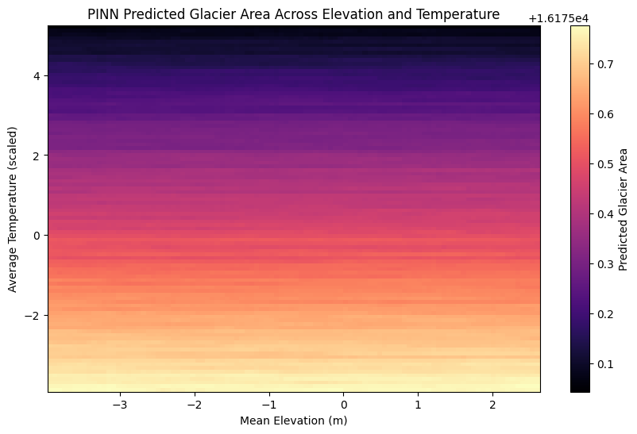

# PhysicsInformedNeuralNetworks_GlacierPrediction

## Overview
This repository contains the implementation of Physics-Informed Neural Networks (PINNs) to predict glacier melting dynamics using the heat equation. This approach integrates physical laws directly into the learning algorithms, enhancing prediction accuracy and reliability. The project includes two main neural network models: a traditional model and a Physics-Informed Neural Network model, each designed to simulate glacier melting under different environmental conditions.

## Visualizations
Below are the heatmap visualizations comparing the traditional sequential model and the Physics-Informed Neural Network model:

| Traditional Sequential Model | PINN Model |
|------------------------------|------------|
|  |  |

## Features
- **Data Handling:** Load and preprocess glacier attribute data from CSV files.
- **Neural Network Models:** Implementation of traditional and Physics-Informed Neural Networks (PINNs).
- **Custom Loss Function:** Incorporates the heat equation into the model's training process.
- **Visualization:** Heatmap visualizations of the model's predictions with respect to changes in elevation and temperature.

## Getting Started
### Prerequisites
- **Languages and Libraries**: Python 3.x, Pandas, NumPy, PyTorch, Matplotlib, scikit-learn
- **Platform**: Google Colab for running the notebooks

### Running the Code
1. **Clone the Repository**
   ```bash
   git clone https://github.com/Dixithakorvi/PhysicsInformedNeuralNetworks_GlacierPrediction.git
   cd PhysicsInformedNeuralNetworks_GlacierPrediction
2. **Upload Notebooks**
- Upload the notebook files to Google Colab.
- Ensure that all dataset paths are correctly set as per your Google Drive structure.
3. **Install Required Libraries**
- Run the following command in the Colab notebook to install the required libraries:
  ```python
  !pip install numpy pandas torch matplotlib scikit-learn
  ```
4. **Execute the Notebooks**
- Execute the cells in the notebook to train the models and generate predictions.

### Visualization
The repository includes scripts for generating heatmap visualizations of the predictions made by the PINN model. These visualizations depict how predicted glacier areas change with elevation and temperature.
- **Viewing Heatmaps**
- After running the visualization sections of the notebooks, the heatmaps will be displayed directly in Google Colab.

## Contributing
Feel free to fork this repository and submit pull requests to contribute to this project. You can also open an issue if you find any bugs or have suggestions for additional features.
